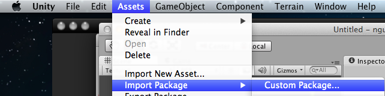
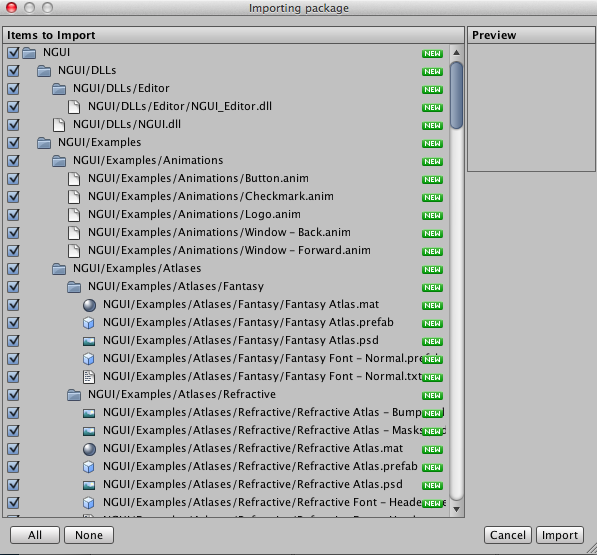
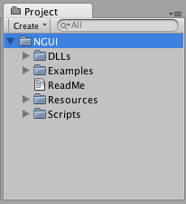

# NGUI 개발 환경 준비하기

## Unity3D 와 NGUI 설치하기

Unity3D 와 NGUI 모두 상용 소프트웨어이지만, 다행히 테스트 목적으로 약간의 기능 제약이 있는 **프리 버전**을 제공하고 있습니다. 

Unity3D 프리 버전은 공식 홈페이지 <http://unity3d.com/unity/download/> 에서 다운로드 받을 수 있으며, 설치시 라이센스를 프리버전으로 등록하면 됩니다. NGUI 역시 제작사 홈페이지 <http://www.tasharen.com/?page_id=140> 에서 평가판 <http://www.tasharen.com/get.php?file=NGUI> 을 받아볼 수 있습니다.

Unity3D 를 실행한 다음 메인 메뉴 > Assets > Import Package > `Custome Package` 를 선택합니다.

다운로드 받은 `ngui_free.unitypackage` 파일을 선택하면 임포트 다이얼로그가 표시됩니다.

오른쪽 아래 Import 를 클릭하면 Project 패널에 NGUI 플러그인이 등록됩니다.

